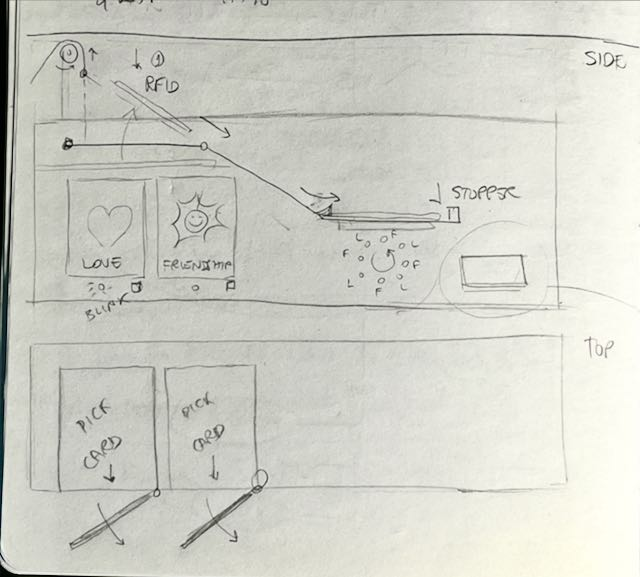
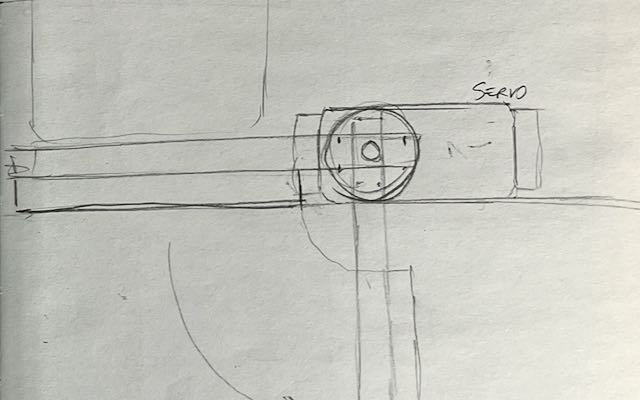
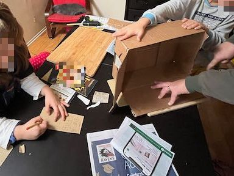
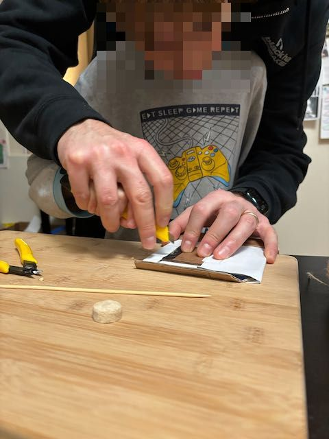
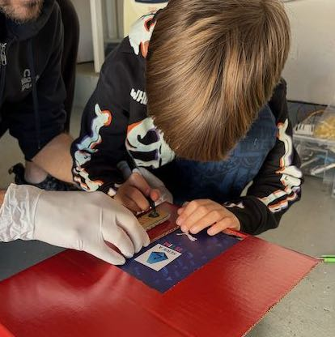
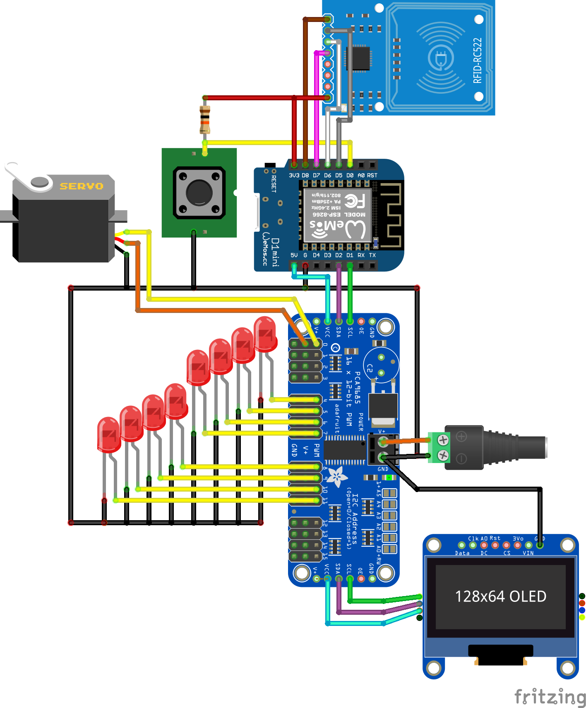
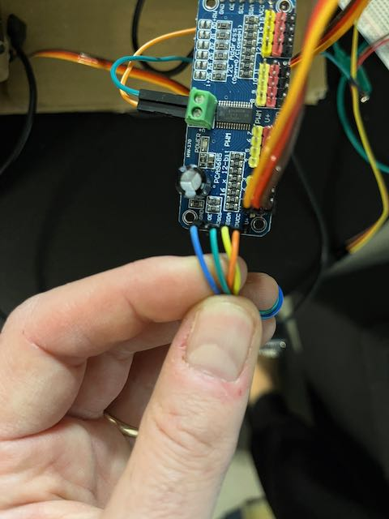
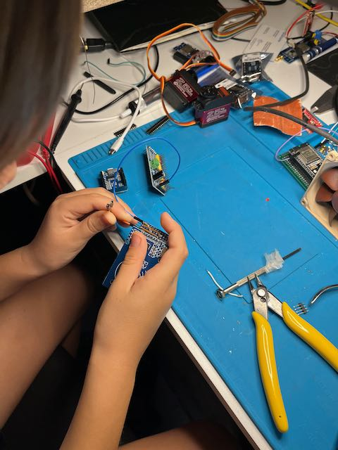
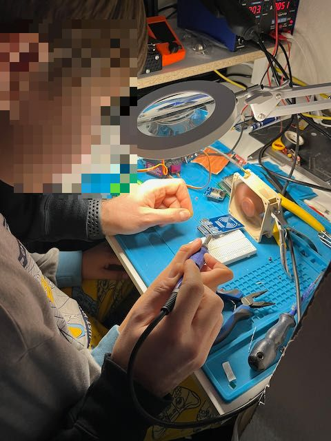
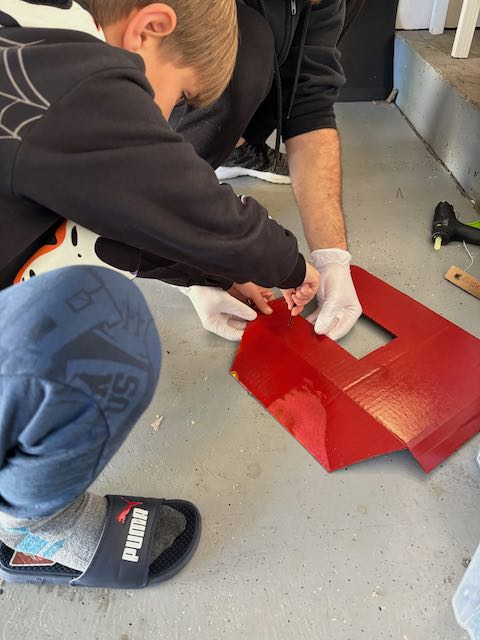

# Valentine's Card-dispensing Compound Machine

Creating a compound machine out of cardboard, toothpicks, and other recycled
material is a fun activity through which you can see the basics of mechanical
physics in action.


By combining inclined planes, levers, pulleys and other simple machines, you
can make little objects, like marbles or playing cards, move.

My son was asked to build a compound machine as science project. The machine is
expected to dispense cards as a way to celebrate Valentine's Day with
classmates.

I decided to "STEM+ the heck out of this project" and involve my son to let him
practice with logic and fine manipulation skills. The overall idea was that the
compound machine should have a manual as well as an automated part, with the
latter governed by a simple input-ouptut logic. To build the circuitry, my son
had the opportunity to learn and practice with cutting, gluing, soldering small
objects, and understanding what inputs can trigger an automation logic that can
be designed entirely from scratch.

## Simple and Compound Machines

We wanted our compound machine to have a pulley, an inclined plane, and a
little swing door that would open to reveal a stack of Valentine's cards. The
rough idea was that the input could be any small object that slides on the
inclined plane, which is in turn actuated by a manual pulley that pulls a flat
plane from one end, making it an inclined plane. The input object that slides
will then bump into something that triggers the the door to open.



## Parts

You can follow along but you're encouraged to make your own tweaks and changes
to make it you own. Let your immagination and creativity fly!

Here's what we've used. For the mechanical and support component:

- recycled cardboard,
- paper straws,
- twine,
- sheets of paper,
- wood skewers.

For the automation component:

- an Arduino-compatible development board: 1x[ESP8266](https://a.co/d/aZeioCo) $2-3/ea.
- Assorted colored LEDs in the 3-5V range: [100pcs](https://a.co/d/4tDfaRZ) $4-5/box.
- A digital servo motor: 1x[SG90](https://a.co/d/939hsJN) $3-4/ea.
- An RFID reader + card or tag: 1x[RC522](https://a.co/d/fCH32ee) $3-4/ea (with cards).
- An OLED display: 1x[SH1106 128x64](https://a.co/d/7zYwehg) $6-7/ea.
- A PWM driver to control LEDs and servo: 1x[PCA9685](https://a.co/d/7VSY1Wy) $5-7/ea.
- A button: [50pcs](https://a.co/d/23IB9QI) $7/box.
- Jumper wires or other spare wires to strip and solder.

The tools and consumables we used include:

- cutters,
- scissors,
- hot glue gun,
- soldering iron,
- sharpies,
- spray paint.

## Mechanical Design

The whole machines should not be too big, so we've set the boundaries of our design
to fit within a wine box (eh eh!).

1. The flat plane holds an RFID card.
1. An axle with a wheel is used to roll and pull a twine.
1. The twine is connected to a pulley, that pulls up the flat plane.
1. The flat plane becomes an inclined plane.
1. The RFID card slides onto a fixed include plane.
1. Two rails hold the card in place to make it stop precisely on a second flat plane.
1. Under the flat plane, an RFID sensor reads the card.
1. The card reader tells the ESP8266  that it's time to do some magic.
1. The logic makes the LEDs flash and displays something on the OLED display.
1. After flashing, the logic turns on the servo motor in the "open" position.
1. A hinge that holds the cardboard door is connected to the servo motor through
   a [3D-printed cam-like lever](https://www.thingiverse.com/thing:1323380) that pushes the door open.



## Logic Design

The software should be very simple, blocking, and real time. No interrupts, no
threads or other types of asynchronous tasks.

At boot, reset the door if open and display a welcome message on the OLED.

The loop is as follows:

1. Block until a card is detected.
1. When a card is detected, power on the LEDs in sequence, making them appear
   like a simple animation.
1. When LEDs have turned off, display a heart symbol on the OLED display.
1. When the OLED has finished, open the door.
1. When the button is pushed, close the door and restart the loop.


## Mechanical Development

I won't go into the detail, because every simple machine and their composition
should is the most fun and creative part, so I'll leave some sketches and casual
pictures below.







## Circuitry

You can use a breadboard and jumper wires, solder, or work on a perforated
board, depdending on the time and skills. Choose the external power depending
on the servo motor specifications. The motors I had lying around are certainly
too powerful for the job so they needed at least 6.5V, but your may work well
at 5V. Don't use the 5V provided by the main (Arduino) board, as the motor may
pull substantial power and damage the main board, which can only offer limited power.








## Logic Development

The complete code is in the `src/main.ino` file of this repository. Let's focus
on the main loop, with some comments added for clarity:

```arduino
void loop() {
  /* This could have been done much more elegantly using an event-based loop,
   * but time is scarce. */

  // set pin D0 as INPUT
  buttonSetup();

  // display a welcome message on the OLED
  displayWelcome();

  // wait for RFID card
  while (!(mfrc522.PICC_IsNewCardPresent() && mfrc522.PICC_ReadCardSerial()));

  // at this point the pulley is pulled and the
  // card slides down, reaching the RFID reader

  delay(200);

  // blink LEDs to indicate that an input has been
  // correctly processed
  ledBlink();

  // display a heart shape on the OLED display
  displayHeart();

  // wait a couple of seconds
  delay(2000);

  // count number of love (RFID card) recevied
  love++;
  updateDisplay(false, false);

  delay(200);

  // trigger the servo motor to open the door
  doorOpen();


  // wait for button pressed
  while (digitalRead(BTN_PIN) != LOW) {
    delay(250);
  }

  // close the door
  doorClose();

  // count number of cards dispensed
  cards++;
  updateDisplay(true, true);

  // wait a couple of seconds before starting a new round
  delay(2000);
}
```

## Credits

This project wouldn't have been possible without:

- [miguelbalboa/MFRC522](https://github.com/miguelbalboa/rfid)
- [adafruit/Adafruit PWM Servo Driver Library](https://github.com/adafruit/Adafruit-PWM-Servo-Driver-Library)
- [adafruit/Adafruit GFX Library](https://github.com/adafruit/Adafruit-GFX-Library)
- [R2D2 - Servo Driven Hinge Design](https://www.thingiverse.com/thing:1323380)

## License

- [GPL Version 3](license.txt)
